<div align="center">

<picture>
  <source media="(prefers-color-scheme: dark)" srcset="./assets/leaves-night.svg">
  <source media="(prefers-color-scheme: light)" srcset="./assets/leaves-day.svg">
  
</picture>

<br>

<sub>
os bancos guardam memórias<br>
de tudo que já passou.<br><br>
o que fiz será esquecido,<br>
assim como o que restou.<br><br>
apenas sigo.
</sub>

<br><br>

<kbd>postgres</kbd> · <kbd>linux</kbd> · <kbd>silêncio</kbd>

</div>

<!--
Tudo permanece
Mas ainda muda
Bem levemente
De dia e de noite
O sútil acontece
Quando tudo permanece
-->


# Olá, eu sou o Carlos! 👋

Sou um desenvolvedor Pleno **Full Stack** com forte foco em arquitetura de sistemas, construção de produtos escaláveis e soluções digitais completas.
Atuo tanto no front quanto no back-end, com experiência em desenvolvimento Web, Mobile (com React Native + Expo) e APIs RESTful seguras e bem documentadas.

---

## 🧱️ Sobre mim
Concluí minha formação como Desenvolvedor Full Stack pela Kenzie Academy Brasil em 2023.
Atualmente, curso o 5º período do Bacharelado em Sistemas de Informação pelo Instituto Federal Goiano – Campus Ceres.
- ☑️ Especialista em **TypeScript, React, Node.js, Prisma e PostgreSQL**
- ☑️ Arquiteto de sistemas: penso do banco ao layout
- ☑️ Experiência real com soluções de uso institucional (saúde e administração)
- ☑️ Estruturação de sistemas completos: backend, frontend, mobile, DevOps
- ☑️ Trabalho em soluções que são utilizadas diariamente por centenas de pessoas

Estou sempre evoluindo meus conhecimentos em arquitetura limpa, boas práticas de projeto, segurança, responsividade, performance e experiência do usuário.

---

## 📈 Destaques

### 🏥 Conecta IMEC
Plataforma de comunicação interna para ambiente hospitalar com feed, calendário, área de benefícios e administração de eventos.

### 🎓 Capacita IMEC
Sistema educacional para colaboradores com emissão de certificados e acompanhamento de progresso. *(em desenvolvimento)*

### 📅 IMEC Formulários
Plataforma responsiva para gestão de formulários clínicos (Ressonância/Tomografia) com validador, dashboard, controle de acesso e relatórios.

---

## 🚀 Tecnologias principais

```txt
React, React Native, TypeScript, Node.js, Express, Prisma, PostgreSQL,
JWT, Docker, Zod, Git, Swagger, Styled Components, Expo, Vercel
```

---

## ✨ Quer saber mais?

Se você chegou até aqui, provavelmente já sabe que:
- Eu construo com profundidade
- Domino diversas camadas de desenvolvimento
- Mas deixo **espaço para você perguntar o que ainda não revelei aqui** ;)

---


📍 Me acompanhe ou entre em contato:

- [LinkedIn](https://www.linkedin.com/in/carlosklz//)
- [Instagram](https://www.instagram.com/klz.carlos/)
